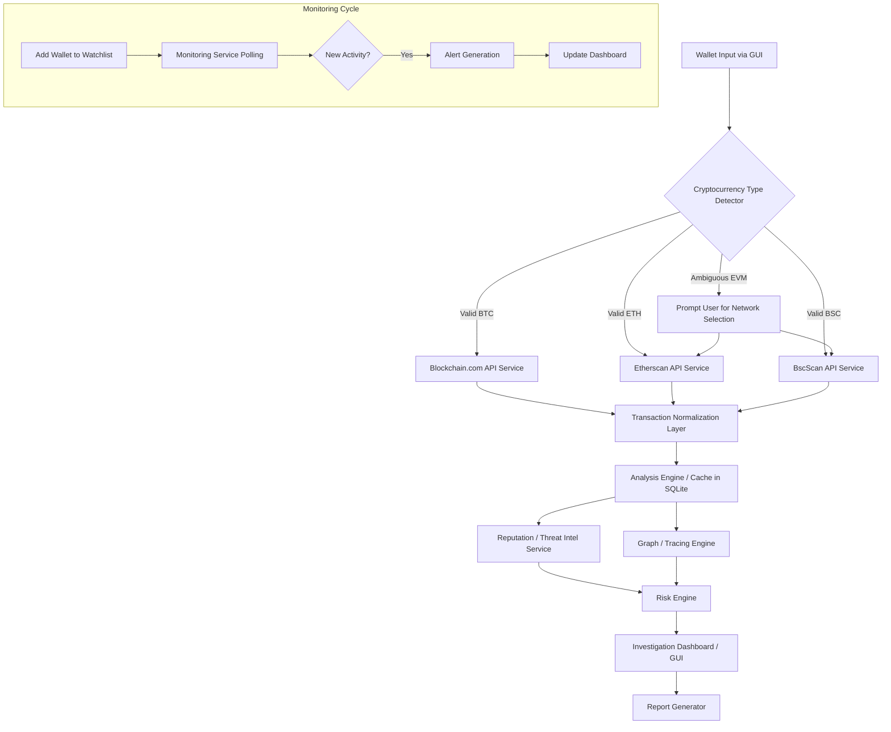

# Data Flow: Cryptonexis

The following represents the lifecycle of a target wallet investigation.

## Flow Description
1. **Input**: User enters a wallet address.
2. **Detection**: `crypto_detector.py` validates format. If ambiguous (e.g., `0x`), GUI asks the user to clarify ETH vs BSC.
3. **Retrieval**: Service layer fetches data from the respective block explorer API.
4. **Normalization**: `transaction_parser.py` maps the network-specific JSON into a standard dictionary.
5. **Storage/Analysis**: Transactions are evaluated for volume/velocity and saved to the Case database.
6. **Correlation**: 
   - `graph_engine.py` builds the multi-hop visualization.
   - `reputation_service.py` checks intelligence feeds for associated tags.
7. **Risk Scoring**: `risk_engine.py` consumes all findings to produce a defined risk assessment score.
8. **Presentation & Reporting**: Results are shown in the GUI and can be exported as a comprehensive report.
9. **Monitoring**: If flagged for monitoring, the background service periodically queries the API for delta changes, generating alerts upon new blocks/transactions.
