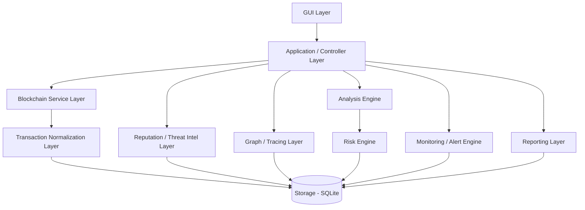

# System Architecture: Cryptonexis

## High-Level Architecture
Cryptonexis uses a modular, layered architecture designed to separate concerns. This structure ensures that user interface elements, application logic, external service integrations, and data persistence can be maintained and updated independently.

## Component Responsibilities

### 1. GUI Layer
- Built using `Tkinter` and `ttkbootstrap`.
- Renders the dashboard, transaction visualizations, graphs, investigation views, and configuration panels.
- Triggers application workflows based on user input.

### 2. Application / Controller Layer
- Mediates between the GUI and the underlying services.
- Orchestrates complex workflows (e.g., initiating a multi-hop trace, running risk analysis, and generating a final report).

### 3. Blockchain Service Layer
- Handles external API communications with block explorers (Blockchain.com, Etherscan API V2, BscScan API).
- Manages rate limiting, timeouts, API keys, and HTTP request retries.

### 4. Transaction Normalization Layer
- Translates specific blockchain API responses into the application's universal transaction model.
- Ensures the Analysis Engine receives consistent data structures regardless of the source network.

### 5. Analysis Engine
- Includes the Cryptocurrency Type Detector to validate and infer address networks.
- Parses normalized transactions for structural insights (incoming vs outgoing volume, velocity).

### 6. Reputation / Threat Intelligence Layer
- Interfaces with external intelligence APIs (AMLBot, CryptoScamDB, Chainabuse).
- Correlates queried addresses with known ransomware datasets, scam lists, and other threat indicators.

### 7. Graph / Tracing Layer
- Utilizes `NetworkX` to model wallets and transactions as nodes and directed edges.
- Supports graph traversal for multi-hop tracking and path highlighting.

### 8. Risk Engine
- Aggregates heuristics (velocity, multi-hop splits), intelligence layer reports, and historical findings.
- Calculates and labels the "Application-generated investigative risk score".

### 9. Monitoring / Alert Engine
- Maintains a list of monitored addresses.
- Polls or listens for new activity and generates internal alerts.

### 10. Reporting Layer
- Aggregates case data, graphs (via `Matplotlib`), and risk assessments.
- Generates outputs in JSON, PDF, or CSV formats.

### 11. Storage Layer
- Local `SQLite` database handling cases, wallet history, transaction networks, cached intelligence, and system alerts.
